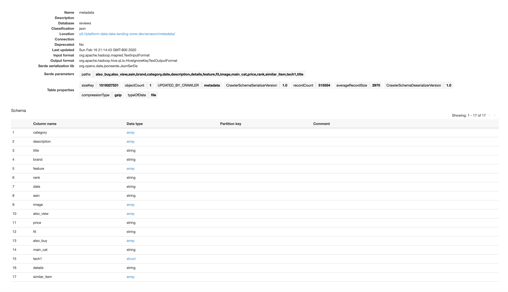

# Amazon Recommender System Application
This is a Recommender System application for Amazon customers.
 
 

 
 
 
## Overview
A personalized ‘shop-by-style’ experience using PyTorch on Amazon SageMaker and Amazon Neptune
 
 
<!--  -->
 
## Table of Contents
 
- [Amazon Recommender System Application](#amazon-recommender-system-application)
  - [Overview](#overview)
  - [Table of Contents](#table-of-contents)
  - [Architecture](#architecture)
  - [Components](#components)
  - [Usage](#usage)
    - [Deployment](#deployment)
    - [Installation](#installation)
  - [Documentation](#documentation)
    - [Serverless ETl](#serverless-etl)
  - [Revisions](#revisions)
  - [Refrences](#refrences)
 
 
## Architecture

 
## Components
The following components refer to modules located in the `src` dir.
 
|  | Module | Description |
| ---- | ------ | -------- |
| 0 | Set up | Prepares local and cloud env. |
| 1 | Data Loader | Loads batch data set to amazon s3. |
| 2 | Data Processor | Prepared product data for modeling.  - Indexer   - Transformer|
| 3 | EDA |  |
| 4 | Product Similarity Model | <dl><dt>**Utilities:**</dt> <ul><li>Modeler</li><li>Inputer</li><li>Outputer</li><li>Predictor</li></ul></dl> |
| 5 | Data Trainer | |
| 6 | Optimizer |  |
| 7 | Model Deployer |  |
| 8 |  Recommender API | Programmatic access to the system |
| 9 | Recommender Web Site | User interface to the recommender system. |
 
 
## Usage
 
### Deployment
 
### Installation
- Install spark
- requirments.txt
- aws cli (optional)
- Neo4J DB
 
## Documentation
### Serverless ETl
Crawler output for raw metadata.

 
Transforming raw data for analysis.

 
 
 
## Revisions
 
## Refrences
 
 
